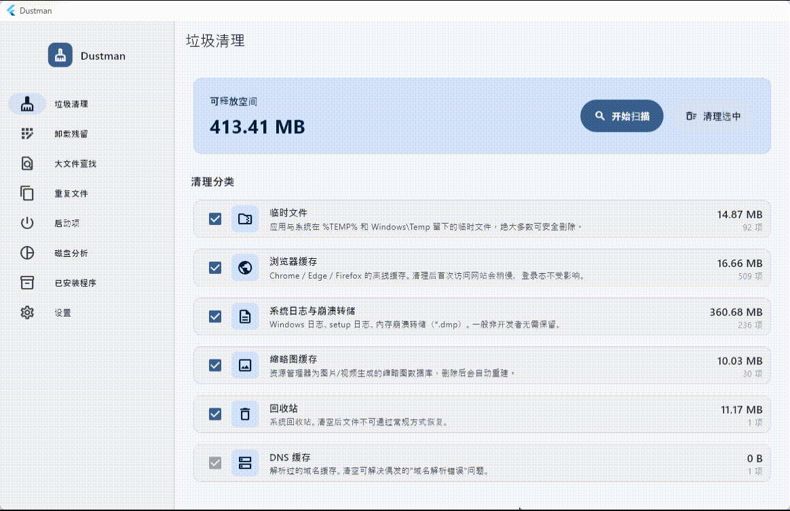
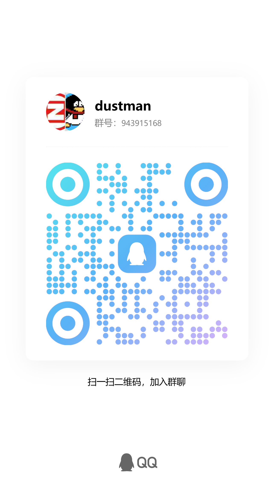

# Dustman

> 一款安全、可视化、可脚本化的 Windows 桌面端垃圾清理工具。基于 Flutter for Windows Desktop。未经授权不得用于商业用途。

Dustman 面向日常 Windows 清理场景，聚焦“能解释、可预览、尽量安全删除”。
当前仓库版本为 v0.3.0，除基础垃圾扫描与清理外，已经包含卸载残留扫描、
大文件查找、重复文件检测、启动项管理、磁盘占用可视化、已安装程序列表、
命令行模式、绿色版数据隔离与中英文切换。

## 界面预览



## 当前功能

### 垃圾清理

- 临时文件：`%TEMP%`、`C:\Windows\Temp`
- 浏览器缓存：Chrome / Edge / Firefox
- Windows 日志与崩溃转储
- 缩略图缓存
- 回收站统计与一键清空
- DNS 缓存刷新

### 系统整理

- 卸载残留扫描：文件系统残留、注册表残留、失效快捷方式
- 大文件查找：递归扫描目录并按大小排序
- 重复文件检测：按大小预筛后做摘要比对
- 启动项管理：注册表 Run / RunOnce 与启动文件夹
- 磁盘分析：TreeMap 可视化目录占用，支持下钻与返回上层
- 已安装程序：读取 Uninstall 信息并拉起原厂卸载器

### 工具能力

- GUI 与 CLI 共用扫描能力
- 支持 `scan` / `clean` 子命令与 JSON 输出
- 支持绿色版模式：可执行文件同目录放置 `portable.flag`
- 支持浅色 / 深色 / 跟随系统主题
- 支持中文与英文界面切换
- 支持按日 / 周 / 月的清理提醒

后续规划见 [docs/REQUIREMENTS.md](docs/REQUIREMENTS.md)，
架构说明见 [docs/ARCHITECTURE.md](docs/ARCHITECTURE.md)。

## 运行环境

- Windows 10 1809+ / Windows 11
- Flutter SDK >= 3.22
- Dart SDK >= 3.4
- Visual Studio 2022，安装“使用 C++ 的桌面开发”工作负载

## 快速开始

```powershell
git clone https://github.com/followtheart/dustman.git
cd dustman

# 1. 拉取依赖
flutter pub get

# 2. 调试运行
flutter run -d windows

# 3. 发布构建
flutter build windows --release
```

发布产物默认位于 `build\windows\x64\runner\Release\`。

## 发行版次（v0.4+）

从 v0.4 起 Dustman 分两个发行版次：

| 版次 | 包含能力 | 适用场景 |
|---|---|---|
| **Community** | v0.3 全部清理 / 扫描 / TreeMap / CLI / 绿色版 | 默认不联网、无注册、可审计 |
| **Pro** | Community 全部 + FileClaw AI 操作建议、账户 / 会员 | 愿意联网使用 AI 辅助分析 |

构建命令通过 `--dart-define` 选择版次（编译期常量，会触发 tree-shaking）：

```powershell
# 社区版（默认）
flutter build windows --release --dart-define=DUSTMAN_EDITION=community

# 付费版
flutter build windows --release --dart-define=DUSTMAN_EDITION=pro
```

设计细节见 [docs/V0_4_PLAN.md](docs/V0_4_PLAN.md) §10.5。

## Pro 版使用（v0.4）

> 仅 Pro 二进制包含以下能力，并需要配合 [dustman-cloud](../dustman-cloud/) 后端。

### 配置云端地址

启动时通过编译期常量指定云端 base URL，默认 `http://localhost:8000`：

```powershell
flutter build windows --release `
  --dart-define=DUSTMAN_EDITION=pro `
  --dart-define=DUSTMAN_CLOUD_URL=https://api.dustman.example.com
```

### 账户

侧栏「账户」页支持四种模式（顶部 SegmentedButton 切换）：

- **密码登录**：邮箱或手机号 + 密码
- **短信登录**：手机号 + 6 位验证码（OTP 免密）
- **注册**：邮箱或手机号 + 密码 → 收验证码 → 提交激活；激活同事务赠送 50,000 token
- **找回**：邮箱或手机号 → 收验证码 → 设新密码（自动吊销所有设备 refresh token）

登录态：`refresh_token` 用 Windows DPAPI 加密落到 `<AppData>\Dustman\auth.bin`（绿色版落 `<exe_dir>\data\auth.bin`），跨用户 / 跨机器无法解。`access_token` 仅在进程内存。

### AI 分析（✦）

6 个功能页都在 Pro 版加了 ✦ 图标，点击会启动一次云侧 AI 会话：

| 页面 | 入口 | 意图 |
|---|---|---|
| 卸载残留 | 每行 ✦ | 解释注册表 / 文件残留是否安全删除 |
| 启动项 | 每行 ✦ | 解释启动项归属与禁用影响 |
| 已安装程序 | 每行 ✦ | 判断是否安全卸载（驱动 / 运行库识别） |
| 大文件 | AppBar ✦ | 文件分类与清理建议 |
| 重复文件 | AppBar ✦ | 同 hash 组里挑哪个删 |
| 磁盘分析 | AppBar ✦ | 当前目录摘要 + 清理潜力 |

AI 不会自动删除任何文件。涉及写操作的工具会弹出端侧二次确认对话框，**拒绝 / 关闭都视为不执行**。`SafetyGuard` 黑名单（System32 / 用户 Documents 等）始终是硬拦截，AI 即便通过 consent 也无法删除受保护路径。

所有 AI 工具调用都会写一行 JSON 到本地审计日志 `<AppData>\Dustman\logs\fileclaw-YYYY-MM-DD.log`，便于事后追溯。

### 会员

侧栏「会员」页展示当前订阅、余额、SKU 套餐卡片。点「立即开通」弹二维码扫码窗口（微信 / 支付宝），SSE 实时监听订单状态：

- **Stub 模式**（云侧未配置 AK/SK）：订单创建 5 秒后自动 paid，方便联调
- **生产模式**：扫码支付 → 第三方异步通知云侧 → SSE 推送 → 弹窗自动关闭并刷 `/me`

v0.4 测试期所有 SKU 统一 **¥0.01**，仅用于验证支付通路与付费意愿。

### 离线降级

- 云端 `/health` 失败 → AccountScreen 显示「正在恢复会话」直至超时；其它页面完全不受影响（v0.3 全部能力照常使用）
- access_token 过期 → 后台静默用 refresh 换新；refresh 过期或被吊销 → 自动登出，UI 提示重新登录

## 命令行模式

Dustman 启动时会先判断是否为 CLI 子命令；如果匹配，则直接执行并退出，不弹出 GUI。

```powershell
# 查看帮助
.\build\windows\x64\runner\Release\dustman.exe --help

# 扫描全部分类并输出 JSON
.\build\windows\x64\runner\Release\dustman.exe scan --json

# 仅扫描临时文件和浏览器缓存
.\build\windows\x64\runner\Release\dustman.exe scan --category=temp,browser-cache

# 直接清理临时文件并跳过确认
.\build\windows\x64\runner\Release\dustman.exe clean --category=temp --yes
```

当前 CLI 支持的分类标识：`temp`、`browser-cache`、`windows-logs`、`thumbnail-cache`、`recycle-bin`、`dns-cache`。

## 绿色版模式

在可执行文件所在目录放置一个名为 `portable.flag` 的空文件，Dustman 会自动切换为绿色版：

- 设置、计划任务状态、日志统一写入 `<exe_dir>\data`
- 不再使用 `%APPDATA%\Dustman`
- 适合 U 盘或便携目录直接拷贝运行

## 项目结构

```text
lib/
├── main.dart                # GUI / CLI 统一入口
├── app.dart                 # MaterialApp 与 Provider 装配
├── cli/                     # 命令行模式
├── core/                    # 主题、常量、工具、i18n
├── domain/                  # 实体与扫描器抽象
├── data/                    # 扫描器实现、Windows 服务
└── presentation/            # screens / widgets / providers
docs/                        # 需求、架构、设计资产
test/                        # 单元测试
windows/                     # Flutter Windows runner
```

## 开发命令

```powershell
# 依赖检查
flutter pub get

# 静态检查
flutter analyze

# 单元测试
flutter test
```

## 安全策略

- 内置 `SafetyGuard` 白名单，明确阻止 `System32`、`SysWOW64`、用户 `Documents`、`Desktop` 等敏感路径
- 所有清理动作都先扫描、展示、勾选，再进行确认
- 单文件失败不会中断整体任务，而是记录到清理报告与日志
- 日志与偏好文件落盘，便于问题追踪

详见 [docs/REQUIREMENTS.md](docs/REQUIREMENTS.md)。

## 社区

欢迎加入 QQ 群交流使用反馈与开发讨论：



## 许可

待定。
